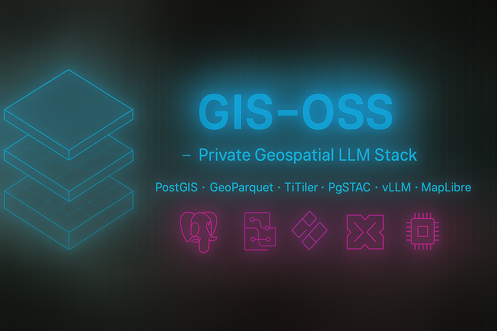
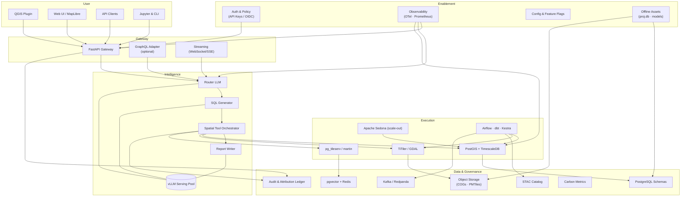

# GIS-OSS — Tribal Environmental Stewardship Copilot

GIS-OSS is a **privacy-first geospatial sandbox** we are outlining for collaboration with Tribal Nations and Indigenous-led organizations. The intent is to shorten watershed analysis, cultural resource protection, climate adaptation planning, and grant preparation—without moving sacred sites or Traditional Ecological Knowledge (TEK) outside tribal control. The design uses open-weight language models alongside trusted PostGIS/GDAL tools so maps, statistics, and reports remain auditable and sovereignty-respecting. Everything described here is meant to ship as Docker-based infrastructure, offline-ready datasets, and tribal-specific governance features—consent protocols, elder approval workflows, audit trails—once they are co-developed and ratified with tribal partners.



## Executive Overview
- Aims to amplify tribal environmental stewardship with on-prem, privacy-preserving tooling.
- Keeps deterministic PostGIS/GDAL workflows central so TEK and cultural layers remain protected.
- Intends to serve tribal GIS teams, environmental departments, and co-management partners who require data residency, consent-driven access, and reproducible analytics.
- Plans to provide practical training materials, demo scripts, and funding-ready outputs for watershed, habitat, climate, and restoration projects once co-developed and approved.

## Project Map
- [Architecture Overview](docs/architecture.md) — system layers, governance hooks, data/ops components.
- [Tribal Environmental Playbook](docs/tribal_environmental.md) — domain pillars, metrics, partner roadmap.
- [Indigenous Data Sovereignty Framework](docs/data_sovereignty.md) — classifications, consent, repatriation.
- [Community Governance & Engagement Process](docs/community_process.md) — advisory bodies, workshops, reciprocity.
- [Legal & Jurisdictional Architecture](docs/legal_architecture.md) — CARE/FPIC enforcement, treaty rights, liability.
- [Developer Experience Plan](docs/developer_experience.md) — SDKs, QA, integrations.
- [Backlog & Milestones](TODO.md) — weekly execution plan.

## Why This Matters Now
- **Open-weight models** (Qwen 2.5, Llama 3.1) enable self-hosted reasoning that respects tribal data sovereignty.
- **Funding tailwinds**: BIL/IRA, EPA, BIA, and DOJ grants prioritize tribal climate resilience, habitat restoration, and environmental justice.
- **Data sovereignty mandate**: TEK and sacred site data cannot leave tribal custody; GIS-OSS keeps every inference, cache, and audit trail inside the firewall.
- **Intended impact**: help environmental staff finish cultural review packets, water-quality reports, and treaty defense briefs faster, while keeping citation trails and redaction controls under tribal approval.

## Core Tribal Environmental Workflows
- **Watershed & Water Rights Defense**  
  Streamflow analysis with treaty overlays, water-quality dashboards, upstream contamination tracing, sacred-site buffers hidden from exports, climate-change stress testing.
- **Cultural Resource & Species Co-Management**  
  Dual knowledge system: TEK observations with role-based access, phenology tracking for first foods, wildlife corridor analysis, NAGPRA-compliant reporting with automatic redaction.
- **Climate Adaptation & Fire Stewardship**  
  Traditional burn planning + LANDFIRE analytics, evacuation routing prioritizing elders/ceremonial sites, smoke impact modeling on feast days, post-fire restoration prioritization.
- **Food Sovereignty & Resilient Agriculture**  
  Traditional crop suitability, pollinator corridor planning, water-efficient irrigation design, wild rice and salmon-run monitoring, nutrition-desert analysis.
- **Land Back & Restoration Prioritization**  
  Fractional ownership untangling, conservation easement scouting, carbon sequestration calculators, historical territory reconstruction, tax parcel acquisition scoring.
- **Environmental Justice & Grant Intelligence**  
  Auto-generated maps/stats for EPA/BIA grants, cumulative impact assessments, climate vulnerability indexing, community health overlays, evidence packs for “data-to-grant” workflows.

Each workflow combines plain-language prompts with spatial analysis—buffers, joins, change detection—and wraps the results with governance safeguards such as sacred-site redaction, consent tracking, and data repatriation.

## Demo Scenarios We Can Share
1. **Sacred Site Storm** — Hurricane approaching ancestral territory: plan evacuations that honor sacred landscapes and safeguard elders’ housing.
2. **First Foods Forecast** — Explore climate impacts on traditional harvest areas (berries, salmon, wild rice) using TEK calendars and satellite data.
3. **Treaty Defense Dashboard** — Monitor upstream permits and water withdrawals affecting treaty-protected fisheries, then assemble a defense brief with citations.
4. **Grant Support Toolkit** — Start with a local environmental concern and build maps, statistics, and narratives ready for EPA/BIA/USDA submissions.

## Value for Tribal Partners & Enablement Teams
- Let environmental staff cut cultural resource reviews from multi-day manual GIS work to <30 minutes while retaining full control over sacred data.
- Package reusable lesson plans: each prompt maps a tribal policy question (“Are treaty-protected fisheries at risk?”) to a map, report, and citation trail ready for council or agency submission.
- Share stories that matter—EPA Environmental Justice grants secured, acres restored, carbon credits documented, youth engaged in mapping programs.
- Provide an on-prem reference stack tribal IT can deploy in a day, with elder approval workflows, audit logging, and “data comes home” policies baked in.

## Data Sovereignty Features (in design)
- Consent-aware data layers (collective consent, elder approval workflows, seasonal access windows).
- Automatic redaction and watermarking of sacred site geometry in external exports.
- TEK licensing metadata (Traditional Knowledge labels, CARE principles).
- Audit ledger capturing who accessed what, under which consent agreement, with cryptographic signing.
- Offline-first deployment path (local models, proj.db, PMTiles) so air-gapped operations remain viable.
- See `docs/data_sovereignty.md`, `docs/community_process.md`, and `docs/legal_architecture.md` for governance, consultation, and legal frameworks.

## Developer Experience (planned)
- OpenAPI 3.1 spec + Redoc portal generated from the FastAPI service (targeting `/docs/openapi.yaml`).
- Typed Python SDK (`gis-oss-sdk`) with sync/async clients and Pydantic models.
- MapLibre playground for composing queries, visualizing tiles, and exporting cURL/Python snippets.
- QGIS plugin template, ArcGIS Pro Python toolbox, and FME Server connector for enterprise workflows.
- Jupyter “magic” commands (`%%gis_oss`) for rapid spatial prototyping in notebooks.
- See `docs/developer_experience.md` for the full DevEx roadmap.

```python
from gis_oss import SpatialAssistant

assistant = SpatialAssistant(base_url="http://localhost:8000", api_key="dev-key")
result = assistant.query(
    "Find upstream industrial permits affecting our fisheries",
    return_format="geojson",
    include_confidence=True,
)
```

## Benchmarks & Targets
- **Latency**: 1.5 s (p50) / 3.0 s (p95) / 6.0 s (p99) for core spatial queries on 200 GB vector + 5 TB raster stack; Phase 2 → 1.0/2.0/4.0 s.
- **Accuracy**: ≥85 % on tribal stewardship QA set (watersheds, TEK overlays, habitat change); ≥92 % with fine-tuned SQL model.
- **Throughput**: Sustain 3 structured queries/sec per GPU; autoscale to 30 analysts during fire season or grant deadlines.
- **Impact metrics**: Acres protected/restored, grant dollars secured, first foods population trends, water-quality improvements, carbon sequestered, youth training hours, elders’ knowledge preserved.

## Modern GIS Component Map
- **Spatial storage**: PostgreSQL + PostGIS + TimescaleDB for vector and temporal analytics.
- **Raster services**: Cloud-optimized GeoTIFFs (COG) via TiTiler; PMTiles/MBTiles for offline basemaps.
- **Vector delivery**: pg_tileserv (or martin) provides MVT tiles for MapLibre, cached via Redis/Varnish.
- **Streaming**: Kafka/Redpanda topics for field telemetry; Kestra triggers downstream processing and alerting.
- **Batch pipeline**: Airflow orchestrates ETL, dbt manages analytical models, Apache Sedona handles large-scale raster/vector crunching.
- **Toolchain**: FastAPI + LLM orchestrator + deterministic PostGIS/GDAL tooling.
- **Integrations**: QGIS plugin, ArcGIS Pro add-in, FME Server webhooks, Jupyter magics ensure humans stay in the loop.

## Layered Architecture Snapshot



### Layer Responsibilities

| Layer | Core Components | Responsibilities |
|-------|-----------------|------------------|
| User | QGIS plugin, Web UI, API clients, Jupyter/CLI | Capture NL queries, render maps/reports, integrate with analyst workflows |
| Gateway | FastAPI gateway, optional GraphQL adapter, streaming endpoints | Authentication, rate limiting, request validation, multi-protocol surface |
| Intelligence | Router LLM, SQL generator, tool orchestrator, report writer, vLLM serving pool | Intent detection, NL→SQL/tool translation, reasoning chains, structured narrative output |
| Execution | PostGIS + TimescaleDB, TiTiler/GDAL, pg_tileserv/martin, Apache Sedona, Airflow/dbt/Kestra | Execute spatial analytics, manage tiles/rasters, schedule ETL, scale out heavy workloads |
| Data & Governance | PostgreSQL schemas, pgvector + Redis, object storage (COGs/PMTiles), STAC catalog, audit ledger, carbon metrics, Kafka/Redpanda | Persist datasets, manage embeddings/caches, track lineage/licensing, stream updates, measure sustainability |
| Enablement & Ops | Auth/OIDC, observability stack, configuration/feature flags, offline asset prep | Security/policy enforcement, monitoring/alerting, configuration management, air-gapped readiness |

## Community & Ecosystem
- Launch **SpatialBench-Tribal** — an open benchmark suite blending watershed defense, cultural resource protection, and climate adaptation tasks.
- Publish a prompt & scenario library (25+ vetted prompts) with notebooks that show expected SQL/tool chains and report templates.
- Partner with tribal colleges, Indigenous Mapping Workshop, Native American Fish & Wildlife Society, and Indigenous Data Sovereignty networks.
- Keep the core stack Apache-licensed while offering enterprise add-ons (HA tooling, enhanced governance, managed hosting).
- See `docs/ecosystem.md` for the detailed community roadmap and success metrics.

## Getting Started (Developers)
1. Install Docker & Docker Compose (v2+).
2. Clone this repository and copy `.env.example` to `.env` with local credentials.
3. Run `./scripts/setup_dev.sh` to launch PostGIS, TiTiler, and auxiliary services.
4. Execute `pytest` to validate spatial tool wrappers before integrating the LLM service.

### For Offline/Air-gapped Deployment
1. On a connected machine, run `./scripts/prepare_offline.sh` to download all dependencies.
2. Transfer the entire project directory including `offline-deps/` to the target system.
3. Set `ENABLE_OFFLINE_MODE=true` in `.env` and follow `offline-deps/OFFLINE_INSTALL.md`.

> Note: Model weights are large (7B–70B parameters). Start with Qwen 2.5 7B (INT8) for development on a single GPU, scaling to 32B/70B models for production accuracy. LoRA adapters for router/SQL/report tiers live under `models/finetuned/`.

## Repository Layout
- `docs/` — Architecture overview, tribal environmental strategy, data sovereignty, community process, legal architecture, deployment notes.
- `core/` *(planned)* — FastAPI backend, LLM orchestration, spatial engine modules.
- `pipeline/` *(planned)* — Airflow DAGs, dbt project, Kestra flows.
- `web/` *(planned)* — MapLibre-based UI for demos and workshops.
- `data/` *(planned)* — Sample GeoParquet/COG/PMTiles assets with clear licensing/TEK tagging.
- `prompts/` *(planned)* — Prompt & scenario library for Tribal use cases.
- `benchmarks/` *(planned)* — SpatialBench-Tribal harness and evaluation scripts.
- `tests/` *(planned)* — Unit + integration harness, plus benchmark scripts.
- `scripts/` *(planned)* — Setup, offline prep, model download, and data seeding utilities.

## Next Executive Checkpoint
- Validate the Week 1 deliverables (running spatial stack + tested tooling).
- Review tribal-specific demo storyboard and training outline.
- Approve partner engagement plan (pilot Tribe shortlist, conference schedule, funding roadmap).

With this focus, GIS-OSS moves from “another GIS tool” to a sovereignty-supporting platform that helps tribes protect lands,
waters, and cultures while adapting to climate change. The privacy-first architecture isn’t just a feature—it’s a requirement
for safeguarding sacred knowledge and delivering measurable environmental outcomes.
