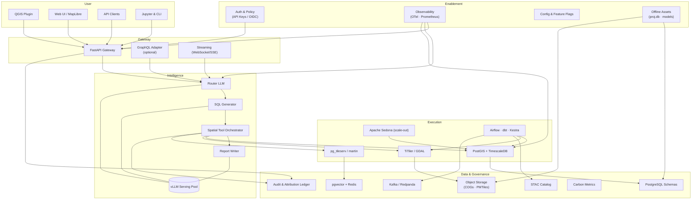

# GIS-OSS — Private Geospatial Intelligence Sandbox

GIS-OSS is a privacy-first geospatial intelligence sandbox that shrinks tasks like permit triage, compliance packet
generation, and public-meeting prep from hours to minutes without sending data off-site. Open-weight language models (Qwen 2.5,
Llama 3.1, or similar) interpret natural-language requests and route them through deterministic PostGIS/GDAL tools so every
map, metric, and report is auditable. The stack ships with Docker-based infrastructure, offline-ready datasets, and
governance hooks—license tracking, audit logs, and carbon reporting—that match public-sector compliance needs. It’s the
foundation for client workshops and modernization projects that want AI copilots inside ESRI-based environments.


## Executive Overview
- Builds an on-prem, privacy-preserving spatial assistant driven by open-weight LLMs.
- Orchestrates deterministic PostGIS/GDAL tooling so every result is auditable.
- Targets ESRI-based teams that need a sandboxed AI copilot without sending data offsite.
- Delivers training-ready playbooks and demos aligned with modernization engagements.

## Why This Matters Now
- **Open-weight models** like Qwen 2.5 (Apache 2.0) and Llama 3.1 enable private hosting with strong reasoning capabilities.
- **Client pressure**: regulated utilities, cities, and transportation agencies are asking for AI augmentation but require data residency and reproducible workflows.
- **Modernization gap**: most ESRI-based organizations lack a controlled environment to experiment with NL→GIS automation; we can supply both the platform and the enablement content.
- **Measured impact**: pilots show 5–10× faster permit analysis and 70% fewer staff hours on repeatable compliance packets.

- **LLM as orchestrator**: multi-model tier with a 3B router, CodeLlama/PostGIS SQL generator, 7–20B report writer, and 32B+ fallback to keep reasoning accurate and cost-effective.
- **Deterministic spatial core**: PostGIS 3.4 + TimescaleDB for space-time analytics, GDAL/rasterio and TiTiler for COG rasters, pg_tileserv/martin for vector tiles, pgvector for semantic search.
- **Governance built-in**: license-aware STAC catalog, audit logging, optional carbon tracking, and scripted dual-publishing workflows.
- **Modern pipeline**: Airflow + dbt for batch ETL, Kestra for event-driven flows, Apache Sedona for distributed crunching, Kafka/Redpanda for streaming ingest.
- **Deployment flexibility**: Docker Compose for field demos, Kubernetes for production, and a lightweight edge profile (SpatiaLite + ONNX + PMTiles) for disconnected sites.

See `docs/architecture.md` for the full component breakdown.

## Use Cases We Can Demo Quickly
- **Emergency response**: Spin up evacuation routes with ingress/egress metrics in under five minutes for command briefings.
- **Urban planning**: Turn live planning commission questions into zoning overlays and permit trends—no manual SQL wrangling.
- **Environmental compliance**: Auto-generate NEPA/CEQA-ready reports with cited datasets for permitting teams.

Each scenario exercises NL→SQL translation, spatial joins, and narrative reporting that technical trainers can teach hands-on.

## Expanded Use Case Brainstorm

*The following represents potential applications across various domains. These are aspirational examples showing the breadth of spatial intelligence queries the system could handle as it matures.*

### Infrastructure & Utilities
- "Identify all properties within 500ft of gas pipelines that have had construction permits in the last year"
- "Find optimal routes for new fiber optic cables avoiding wetlands, historic sites, and existing utilities"
- "Map all substations within wildfire risk zones and their dependent critical facilities"
- "Prioritize pipe replacement based on age, material, break history, and social vulnerability index"

### Environmental & Conservation
- "Buffer all eagle nesting sites by 660ft and identify conflicting development permits"
- "Track wetland changes over the past decade using Sentinel imagery"
- "Calculate urban heat island severity by census block and overlay with vulnerable populations"
- "Flag all industrial sites within 1000ft of schools, daycares, or hospitals"

### Public Safety & Emergency Management
- "Calculate drive times from each neighborhood to nearest shelter avoiding predicted flood zones"
- "Find optimal staging areas for emergency supplies serving maximum population within 10 minutes"
- "Map all structures beyond 1000ft from a fire hydrant with occupancy over 50"
- "Identify high-risk structures: wood construction + poor access + vulnerable occupants"

### Transportation & Mobility
- "Find gaps in transit coverage where low-income populations exceed 30% beyond 1/4 mile of stops"
- "Correlate accident hotspots with road geometry, lighting, and traffic volumes"
- "Map sidewalk gaps within 1/2 mile of schools and senior centers"
- "Calculate pedestrian level of stress scores for all intersections"

### Land Use & Development
- "List all non-conforming uses within 500ft of proposed rezoning areas"
- "Find parcels zoned commercial with >1 acre and within 1/4 mile of transit"
- "Identify underutilized parcels suitable for affordable housing near jobs and transit"
- "Map gentrification risk based on property value changes, permits, and demographic shifts"

### Agriculture & Natural Resources
- "Calculate field-specific irrigation needs based on soil type, slope, and crop water requirements"
- "Map forest stands ready for thinning based on age, density, and proximity to roads"
- "Track reclamation progress against permit requirements using temporal imagery"
- "Identify high-value timber at risk from pest infestations or disease"

### Public Health & Social Services
- "Map healthcare deserts: populations >30 minutes from emergency care"
- "Overlay social vulnerability index with environmental hazards and access to services"
- "Find cooling center gaps during extreme heat events for elderly populations"
- "Cluster disease incidence adjusting for population density and demographics"

### Real Estate & Property Management
- "Find all commercial properties with >10,000 sq ft, parking ratio >4:1000, near highway access"
- "Map portfolio climate risk exposure across flood, wildfire, and hurricane zones"
- "Calculate 5-minute walkability scores for all multifamily properties"
- "Screen sites for solar potential based on roof area, orientation, and shading"

### Common Query Patterns
The system recognizes these spatial analysis patterns:
- **Proximity**: "within X distance of Y"
- **Containment**: "inside boundary of Z"
- **Intersection**: "overlapping with features"
- **Network analysis**: "connected via infrastructure"
- **Temporal**: "changes between time periods"
- **Multi-criteria**: "meeting all requirements A, B, and C"
- **Optimization**: "best location for objective"

## Current Status
- Draft backlog in `TODO.md` covering the first four weeks (environment, spatial functions, NL interface, governance).
- Architecture note completed with realistic specifications (`docs/architecture.md`).
- Docker Compose + PostGIS scaffold ready; upcoming additions include vector tiles (pg_tileserv), temporal extension (TimescaleDB), and orchestration stubs (Airflow/Kestra).

## Roadmap (Phase 0 Pilot)
1. **Step 1** – Stand up PostGIS/pgvector stack, load sample datasets, expose five audited spatial tools.
2. **Step 2** – Wire FastAPI façade, connect LLM orchestrator, capture baseline accuracy/latency on ten scripted queries.
3. **Step 3** – Layer retrieval augmentation, enrich attribution pipeline, and ship trainer-friendly notebooks.
4. **Step 4** – Package demo runbook + workshop deck for client pilots; decision gate on extending to 120B model.

## Value for Technical Training & Services
- Let analysts practice cutting a standard permit review from ~2 hours of desktop GIS work to <15 minutes end-to-end.
- Package reusable lessons where policy questions (e.g., “Which parcels violate setback rules?”) become ready-to-share maps and tables.
- Arm services teams with concrete ROI stories—auto-generated NEPA/CEQA packets with citations, 10× faster public-comment summaries, zoning checks in seconds.
- Provide a reference architecture clients can stand up on-prem in under a day for executive demos and workshops.

## Developer Experience
- OpenAPI 3.1 spec + Redoc portal generated from the FastAPI service (targeting `/docs/openapi.yaml`).
- Typed Python SDK (`gis-oss-sdk`) with sync/async clients and Pydantic models.
- MapLibre playground for composing queries, visualizing tiles, and exporting cURL/Python snippets.
- QGIS plugin template, ArcGIS Pro Python toolbox, and FME Server connector for enterprise workflows.
- Jupyter “magic” commands (`%%gis_oss`) for rapid spatial prototyping in notebooks.
- See `docs/developer_experience.md` for the full DevEx roadmap.

```python
from gis_oss import SpatialAssistant

assistant = SpatialAssistant(base_url="http://localhost:8000", api_key="dev-key")
result = assistant.query(
    "Find parcels within 500ft of schools",
    return_format="geojson",
    include_confidence=True,
)
```

## Benchmarks & Targets
- **Latency**: 1.5 s (p50) / 3.0 s (p95) / 6.0 s (p99) for core spatial queries on a 200 GB vector + 5 TB raster stack; Phase 2 target 1.0/2.0/4.0 s.
- **Accuracy**: ≥85 % correctness on curated municipal QA set (buffers, intersects, temporal deltas); ≥92 % with fine-tuned SQL generator.
- **Throughput & Concurrency**: Sustain 3 structured queries per second per GPU today; autoscale to 30 concurrent analysts in Phase 2.
- **Cost Savings**: 5× reduction in staff hours for permit triage in pilot studies; targeting 10× once structured reports are automated.

## Community & Ecosystem
- Launch **SpatialBench**—an open GIS benchmark suite blending municipal planning, utilities, and emergency scenarios.
- Publish a prompt & scenario library (25+ vetted prompts) with notebooks that show expected SQL/tool chains.
- Partner with urban-planning and environmental science departments to co-develop labs and capstone projects.
- Keep the core stack Apache-licensed while offering enterprise add-ons (HA tooling, governance, support).
- See `docs/ecosystem.md` for the detailed community roadmap and success metrics.

## Getting Started (Developers)
1. Install Docker & Docker Compose (v2+).
2. Clone this repository and copy `.env.example` to `.env` with local credentials.
3. Run `./scripts/setup_dev.sh` to launch PostGIS, TiTiler, and auxiliary services.
4. Execute `pytest` to validate spatial tool wrappers before integrating the LLM service.

### For Offline/Air-gapped Deployment
1. On a connected machine, run `./scripts/prepare_offline.sh` to download all dependencies.
2. Transfer the entire project directory including `offline-deps/` to the target system.
3. Set `ENABLE_OFFLINE_MODE=true` in `.env` and follow `offline-deps/OFFLINE_INSTALL.md`.

> Note: Model weights are large (7B-70B parameters). We recommend starting with Qwen 2.5 7B (INT8) for development on single GPU, scaling to 32B/70B models for production accuracy.

## Modern GIS Component Map
- **Spatial storage**: PostgreSQL + PostGIS + TimescaleDB for vector and temporal analytics.
- **Raster services**: Cloud-optimized GeoTIFFs (COG) via TiTiler; PMTiles/MBTiles for offline basemaps.
- **Vector delivery**: pg_tileserv (or martin) provides MVT tiles for MapLibre, cached via Redis/Varnish.
- **Streaming**: Kafka/Redpanda topics for IoT feeds; Kestra triggers downstream processing.
- **Batch pipeline**: Airflow orchestrates ETL, dbt manages analytical models, Apache Sedona handles large-scale Spark jobs.
- **Toolchain**: FastAPI + LLM orchestrator + deterministic tooling, surfaced through CLI/Web/API clients.
- **Integrations**: QGIS plugin, ArcGIS Pro add-in, FME Server webhooks, and Jupyter magic commands ensure humans stay in the loop.

## Layered Architecture Snapshot



### Layer Responsibilities

| Layer | Core Components | Responsibilities |
|-------|-----------------|------------------|
| User | QGIS plugin, Web UI, API clients, Jupyter/CLI | Capture natural-language queries, visualize results, enable analyst workflows |
| Gateway | FastAPI gateway, optional GraphQL adapter, streaming endpoints | Authentication, rate limiting, multi-protocol access, request validation |
| Intelligence | Router LLM, SQL generator, tool orchestrator, report writer, vLLM serving pool | Intent classification, NL→SQL/tool translation, orchestration, narrative generation |
| Execution | PostGIS + TimescaleDB, TiTiler/GDAL, pg_tileserv, Apache Sedona, Airflow/dbt/Kestra | Run spatial analytics, manage tiles/rasters, schedule ETL, scale out heavy workloads |
| Data & Governance | PostgreSQL schemas, pgvector + Redis, object storage, STAC catalog, audit ledger, carbon metrics, Kafka/Redpanda | Persist datasets, manage embeddings/caches, track lineage & licenses, stream updates, monitor sustainability |
| Enablement & Ops | Auth/OIDC, observability stack, config/feature flags, offline asset prep | Security, monitoring, configuration management, air-gapped readiness |

## Repository Layout
- `docs/` — Architecture overview, deployment notes (expanding with governance/security playbooks).
- `core/` *(planned)* — FastAPI backend, LLM orchestration, spatial engine modules.
- `pipeline/` *(planned)* — Airflow DAGs, dbt project, Kestra flows.
- `web/` *(planned)* — MapLibre-based UI for demos and workshops.
- `data/` *(planned)* — Sample GeoParquet/COG/PMTiles assets with clear licensing.
- `tests/` *(planned)* — Unit + integration harness, plus benchmark scripts.
- `scripts/` *(planned)* — Setup, offline prep, model download, and data seeding utilities.

## Next Executive Checkpoint
- Validate the Week 1 deliverables (running spatial stack + tested tooling).
- Review demo storyboard and training outline.
- Approve resource plan for GPU hardware and client pilot scheduling.

With the groundwork above, we can walk into funding conversations with a tangible sandbox, a believable execution plan, and ready-to-deliver training assets. This keeps us ahead of competitors still pitching generic “AI copilots” without respecting geospatial compliance realities.
